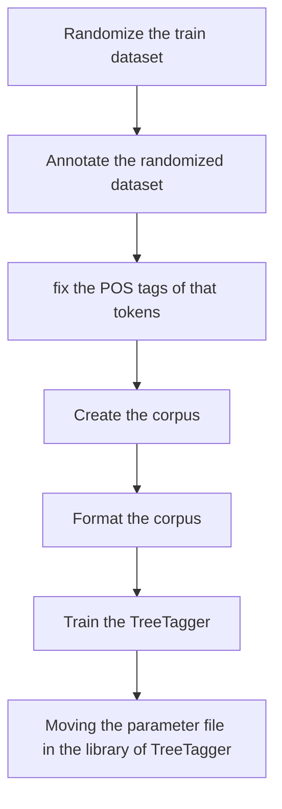
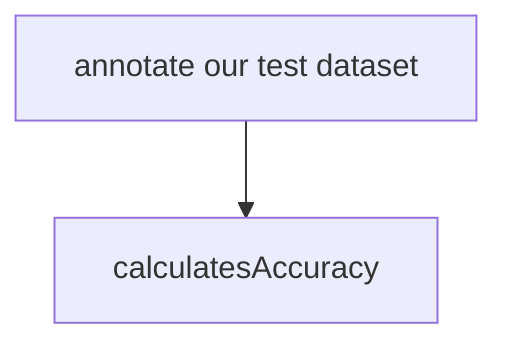

# Training Pipeline
## Overall informations
   1. Lexicon:
     To construct our lexicon we use the texts annotated by human and used in training of the bnc TreeTagger. Since we don't have ressources to process the massive quantity of tokens available in the British National Corpus (BNC) we choose randomaly some annotated files. 
   **Note 1: annotated files are in a xml format and there is a dedicated parser that parses xml files to OnePerLine format. **
   **Note 2: seed and nb_files arguments had been added to reproduce results**

   2. Training dataset 
       100 senetences were generated by chat gpt and revised for each that category :
      * that adverb
      * that conjunction
      * that determiner
      * that relative
## Scripts
   * Train dataset :
     * **randomize_train_dataset.py** 
       A script that loops over the that_files (ex. that_conjunction.txt) generate a pandas dataframe with two columns ['sentence','real_tag'] and store each column in a seperted file. 
     * **fix_train_dataset.py** 
       After annotating the train dataset we need to rectify poorly annotated **that** with the real tags that we stored previously.
   * Lexicon :
     * **get_lexicon_sample.py** 
      In order to understand this script, you must understand the format of the lexicon. 
      A valid lexicon is a lexicon which : 
        * we have a unique entry for each token.
        * the tags of one token must be different for example :  :no_entry_sign: being   be VBG   being NN1   be NN1  
        :white_check_mark: being be VBG being NN1
     * **lexicon_formatter.py** 
     This script will simply remove characters that were added when using the to_csv function from the pandas package, such as **"** It is a script that manipulates the lexicon file in a low-level way..

## DAG of the pipeline

## Arguments of the pipeline
* **nb_sen** : nb of sentences for each that category. For ex. if we set it to 10 we use 10 sentences for each category. (required)
* **nb_lexicon** : nb of random files used to construct our lexicon. (required) 
* **seed** : seed to reproduce the results by choosing the same random files to construct our lexicon. (DEFAULT 42) 
* **st** : as sentence marker tag rather than "SENT". (DEFAULT "SENT")
* **cl** : context length (DEFAULT 2)
* **dtg** : decision tree gain threshold (DEFAULT 0.7)
* **sw** : smoothing weight (DEFAULT 1)
* **ecw** : equivalence class weight (DEFAULT 0.5)
* **stg** : threshold for suffix tree gain (DEFAULT 1)
* **ptg** : threshold for prefix tree gain (DEFAULT 1)
* **lt** : threshold probability for lexical entries (DEFAULT 0) 
:information_source:The default values have been found using the a **grid search**:information_source:

# Testing Pipeline
Briefly this pipeline will annotate the test dataset and then calculates the accuracy. 

# Prerequisites

1. Install the packages using pip : pip install requirements.txt
2. Install xsltproc using command : sudo apt install xsltproc (on linux or windows WSL)
4. Install the files for the lexicon from the link : https://llds.ling-phil.ox.ac.uk/llds/xmlui/handle/20.500.14106/2554
5. move folder 2554/download/Texts/ in ./train_data/
6. move the script 2554/download/XML/Scripts/oneWordPerLine.xsl in train_data/lexicon_scripts/
7. TreeTagger must be installed in the same folder as the pipelines :rotating_light: once the folder of TreeTagger is installed. Move it to the same folder as the pipelines. Then, install the tagging scripts. Finally launch the installer in the same folder *./train_data/TreeTagger/* so it can fix the paths. :rotating_light:.
8. a train dataset is provided.
   
# Examples : 
 *  ./train_pipeline.sh -nb_sen 100 -nb_lexicon 3 -cl 2 -dtg 0.7 -sw 1 -ecw 0.5 -stg 1 -ptg 1 -lt 0
 *  ./test_pipeline.sh
 *  tree-tagger-english-FTthatdev

# Contact
For any question contact : mohamed.boutrik@etu.u-paris.fr 
